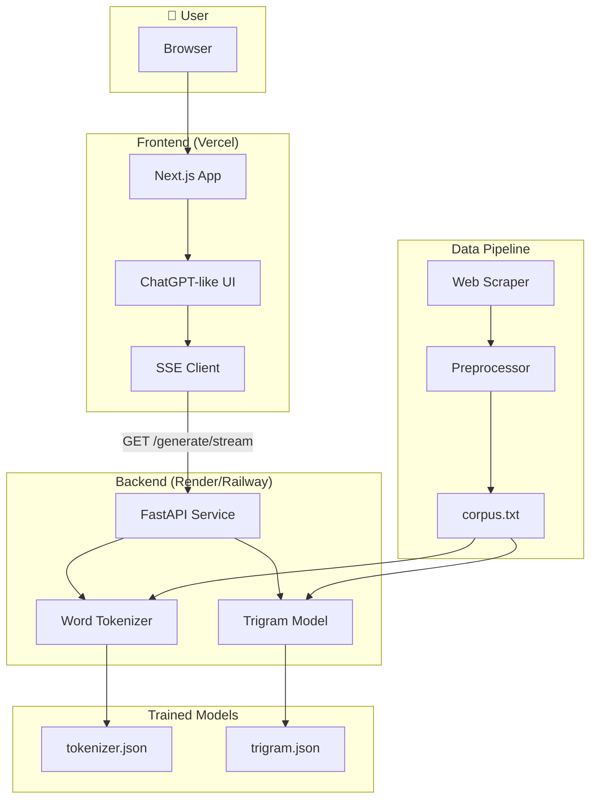
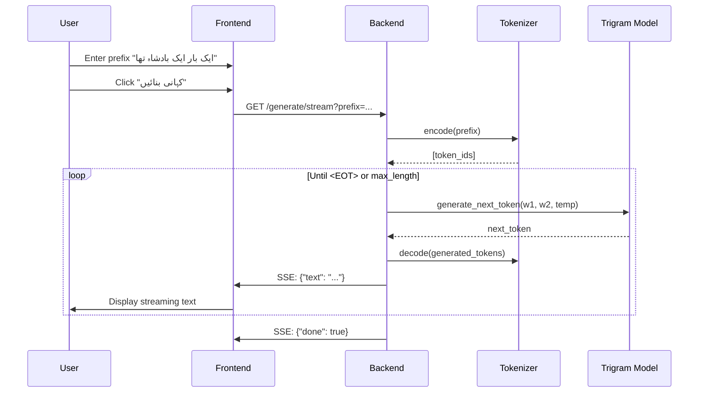
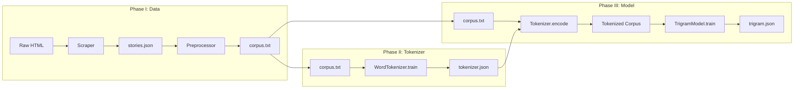
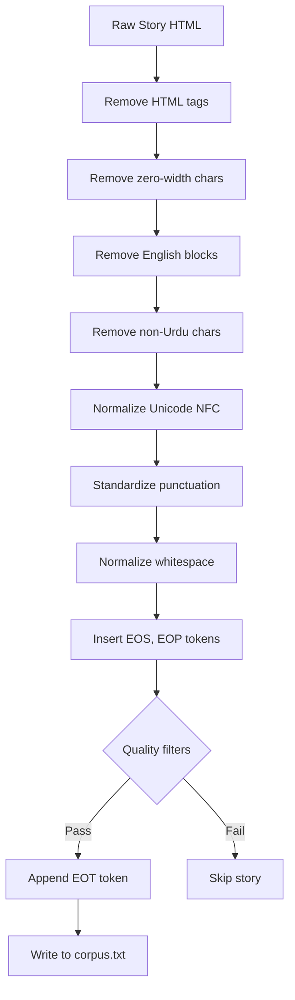
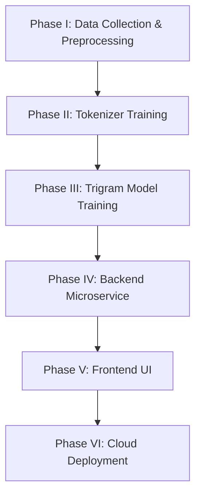

# Urdu Story GenAI System — Mermaid Diagrams

Use these diagrams in any Mermaid-compatible viewer (e.g., GitHub, VS Code Mermaid extension, mermaid.live).

---

## 1. System Architecture (Component Diagram)



---

## 2. End-to-End Request Flow (Sequence Diagram)



---

## 3. Training Pipeline Flow



---

## 4. Trigram Generation Loop

```mermaid
flowchart TD
    Start([Prefix: "ایک بار"]) --> Encode[Tokenizer.encode]
    Encode --> Tokens[prefix_tokens: w1, w2]
    Tokens --> Loop{len < max_length?}
    Loop -->|Yes| Context[Get context: w1=last-2, w2=last-1]
    Context --> Prob[Compute P(w3|w1,w2) for all candidates]
    Prob --> Temp[Apply temperature sampling]
    Temp --> Sample[Sample next_token]
    Sample --> Append[Append to generated]
    Append --> Check{next_token == EOT?}
    Check -->|Yes| Decode[Tokenizer.decode]
    Check -->|No| Loop
    Loop -->|No| Decode
    Decode --> Output([Story text])
```

---

## 5. Preprocessing Pipeline



---

## 6. High-Level Phase Overview


