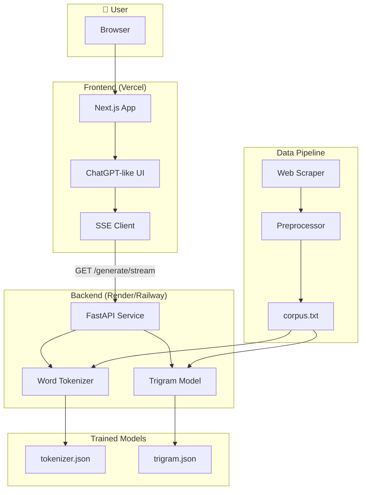
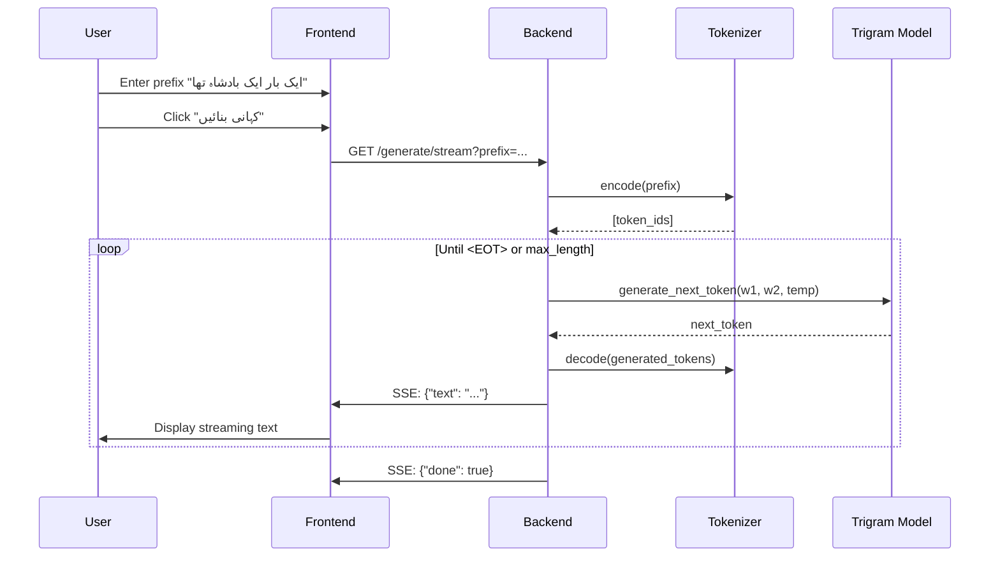
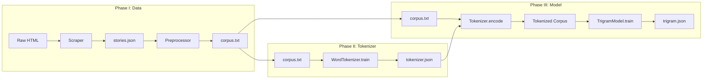
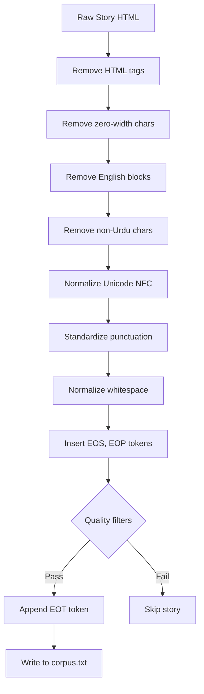

# Urdu Story GenAI System — Theory & Architecture

## Overview

This document provides a detailed theoretical explanation and step-by-step breakdown of the **Urdu Children's Story Generation System**. The project bridges classical NLP (n-gram models, tokenization) with modern software engineering (microservices, streaming, cloud deployment).

---

## Table of Contents

1. [High-Level Architecture](#1-high-level-architecture)
2. [Mermaid Diagrams](#2-mermaid-diagrams)
3. [Phase-by-Phase Theory](#3-phase-by-phase-theory)
4. [Mathematical Foundations](#4-mathematical-foundations)
5. [Data Flow Summary](#5-data-flow-summary)

---

## 1. High-Level Architecture

The system consists of six phases:

| Phase | Component | Purpose |
|-------|-----------|---------|
| **I** | Data Collection & Preprocessing | Scrape Urdu stories, clean text, insert special tokens |
| **II** | Tokenizer Training | Build word-level vocabulary from corpus |
| **III** | Trigram Language Model | Train probabilistic model with MLE + interpolation |
| **IV** | Backend Microservice | FastAPI REST API with streaming |
| **V** | Frontend UI | Next.js ChatGPT-like interface |
| **VI** | Cloud Deployment | Vercel (frontend) + Render/Railway (backend) |

---

## 2. Mermaid Diagrams

### 2.1 System Architecture (Component Diagram)



### 2.2 End-to-End Data Flow (Sequence Diagram)



### 2.3 Training Pipeline Flow



### 2.4 Trigram Generation Loop

```mermaid
flowchart TD
    Start([Prefix: "ایک بار"]) --> Encode[Tokenizer.encode]
    Encode --> Tokens[prefix_tokens: w1, w2]
    Tokens --> Loop{len < max_length?}
    Loop -->|Yes| Context[Get context: w1=last-2, w2=last-1]
    Context --> Prob[Compute P(w3|w1,w2) for all candidates]
    Prob --> Temp[Apply temperature sampling]
    Temp --> Sample[Sample next_token]
    Sample --> Append[Append to generated]
    Append --> Check{next_token == EOT?}
    Check -->|Yes| Decode[Tokenizer.decode]
    Check -->|No| Loop
    Loop -->|No| Decode
    Decode --> Output([Story text])
```

### 2.5 Preprocessing Pipeline (Internal Steps)



---

## 3. Phase-by-Phase Theory

### Step 1: Data Collection (Phase I — Part A)

**What we did:**
- Built a web scraper (`data/scraper.py`) that fetches Urdu children's stories from UrduPoint Kids
- Extracts story titles and content from HTML
- Saves raw data to `data/raw/stories.json`
- Uses polite delays and User-Agent headers to avoid blocking

**Theory:**
- Web scraping provides real-world Urdu text for training
- Minimum 200 stories ensure sufficient diversity for n-gram statistics
- Raw HTML contains noise (ads, navigation) that must be removed

---

### Step 2: Preprocessing (Phase I — Part B)

**What we did:**
- Remove HTML tags and entities
- Remove zero-width and control characters
- Remove large blocks of English text
- Keep only Urdu script (Unicode ranges: 0x0600–0x06FF, 0x0750–0x077F, etc.) and basic punctuation
- Normalize Unicode to NFC form
- Standardize punctuation (dashes, quotes)
- Normalize whitespace
- Insert special tokens:
  - `<EOS>` (U+E001): End of Sentence — after ۔ . ! ؟
  - `<EOP>` (U+E002): End of Paragraph — at double newlines
  - `<EOT>` (U+E003): End of Story — at end of each story
- Quality filters: minimum length, Urdu ratio, word count, deduplication

**Theory:**
- Special tokens in Unicode Private Use Area (U+E000–U+F8FF) avoid conflicts with Urdu script
- These tokens help the model learn sentence/paragraph/story boundaries
- Clean corpus improves n-gram statistics and generation quality

---

### Step 3: Tokenizer Training (Phase II)

**What we did:**
- Implemented a **word-level tokenizer** (`tokenizer/word_tokenizer.py`) — better suited for Urdu than BPE
- Urdu uses spaces between words; word-level tokens give cleaner trigram context
- Vocabulary: special tokens (`<EOS>`, `<EOP>`, `<EOT>`, `<UNK>`) + most frequent words (min_freq=2, max_vocab=8000)
- Saves to `models/tokenizer.json`

**Theory:**
- **Tokenization** converts text into discrete units (token IDs) for the language model
- Word-level: each space-separated word maps to one token
- `<UNK>` handles out-of-vocabulary words during generation
- Smaller vocabulary (vs character-level) reduces sparsity in n-gram counts

---

### Step 4: Trigram Model Training (Phase III)

**What we did:**
- Tokenize entire corpus with the trained tokenizer
- Count unigrams, bigrams, trigrams in the corpus
- Compute **Maximum Likelihood Estimation (MLE)** probabilities:
  - P(w) = count(w) / total_tokens
  - P(w2|w1) = count(w1,w2) / count(w1)
  - P(w3|w1,w2) = count(w1,w2,w3) / count(w1,w2)
- Apply **linear interpolation** to smooth probabilities:
  - P(w3|w1,w2) = λ3·P_MLE(w3|w1,w2) + λ2·P_MLE(w3|w2) + λ1·P_MLE(w3)
  - Default: λ1=0.1, λ2=0.3, λ3=0.6
- Save counts and parameters to `models/trigram.json`

**Theory:**
- **N-gram models** assume Markov property: next word depends only on previous (n-1) words
- **Smoothing** is essential: many trigrams never appear in training (sparsity)
- Interpolation combines trigram, bigram, unigram to handle unseen contexts

---

### Step 5: Generation (Inference)

**What we did:**
- Given prefix tokens (w1, w2), compute P(w3|w1,w2) for all candidate next tokens
- Apply **temperature sampling**: prob' = prob^(1/T)
  - T=1: unchanged; T>1: more random; T<1: more deterministic
- Sample next token from the distribution
- Append to sequence; use (w2, w3) as new context
- Stop when `<EOT>` is generated or max_length reached

**Theory:**
- **Autoregressive generation**: each token conditions on the previous ones
- Temperature controls diversity vs coherence trade-off

---

### Step 6: Backend Microservice (Phase IV)

**What we did:**
- FastAPI service with two endpoints:
  - `POST /generate`: returns full story in one response
  - `GET /generate/stream`: Server-Sent Events (SSE) — streams story token-by-token
- Loads tokenizer and model at startup
- CORS enabled for frontend
- Dockerized for deployment

**Theory:**
- REST API decouples frontend from model implementation
- Streaming improves UX (ChatGPT-like typing effect) without waiting for full generation

---

### Step 7: Frontend (Phase V)

**What we did:**
- Next.js app with RTL (right-to-left) support for Urdu
- Textarea for prefix input; suggestion chips for quick starts
- Fetches `/generate/stream`, parses SSE events, updates UI in real time
- Loading messages in Urdu for playful UX

**Theory:**
- RTL is required for proper Urdu display
- SSE allows incremental updates without WebSockets

---

### Step 8: Deployment (Phase VI)

**What we did:**
- Frontend: Vercel (auto-deploy from GitHub)
- Backend: Render or Railway (Docker build, runs uvicorn)
- Environment variable `NEXT_PUBLIC_API_URL` links frontend to backend

---

## 4. Mathematical Foundations

### 4.1 Maximum Likelihood Estimation (MLE)

For n-grams:

- **Unigram:** \( P(w) = \frac{\text{count}(w)}{N} \)
- **Bigram:** \( P(w_2 | w_1) = \frac{\text{count}(w_1, w_2)}{\text{count}(w_1)} \)
- **Trigram:** \( P(w_3 | w_1, w_2) = \frac{\text{count}(w_1, w_2, w_3)}{\text{count}(w_1, w_2)} \)

### 4.2 Linear Interpolation

\[
P(w_3 | w_1, w_2) = \lambda_3 \cdot P_{\text{MLE}}(w_3 | w_1, w_2) + \lambda_2 \cdot P_{\text{MLE}}(w_3 | w_2) + \lambda_1 \cdot P_{\text{MLE}}(w_3)
\]

where \( \lambda_1 + \lambda_2 + \lambda_3 = 1 \).

### 4.3 Temperature Sampling

\[
p'_i = \frac{p_i^{1/T}}{\sum_j p_j^{1/T}}
\]

- \( T = 1 \): original distribution
- \( T > 1 \): flatter distribution (more diverse)
- \( T < 1 \): sharper distribution (more deterministic)

---

## 5. Data Flow Summary

| Stage | Input | Output |
|-------|-------|--------|
| Scraping | URLs | `data/raw/stories.json` |
| Preprocessing | stories.json | `data/processed/corpus.txt` |
| Tokenizer training | corpus.txt | `models/tokenizer.json` |
| Model training | corpus.txt + tokenizer | `models/trigram.json` |
| Inference | prefix string | generated story (streaming) |

---

## Quick Reference: File Roles

| File | Role |
|------|------|
| `data/scraper.py` | Web scraper for Urdu stories |
| `data/preprocess.py` | Clean text, insert special tokens |
| `data/create_sample_dataset.py` | Fallback if scraping fails |
| `tokenizer/word_tokenizer.py` | Word-level tokenizer |
| `tokenizer/bpe.py` | BPE tokenizer (legacy) |
| `model/trigram.py` | Trigram LM with MLE + interpolation |
| `train_tokenizer.py` | Train and save tokenizer |
| `train_model.py` | Train and save trigram model |
| `backend/main.py` | FastAPI service |
| `frontend/app/page.tsx` | Next.js UI |
| `run_pipeline.py` | Run full pipeline (scrape → preprocess → train) |

---

*Document generated for the Urdu Story GenAI System project.*
